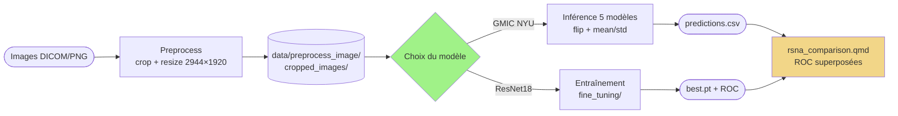

# Détection de cancer du sein sur mammographies

[](https://www.python.org/)
[](https://pytorch.org/)
[](LICENSE)

> Pipeline d'analyse de mammographies basé sur le modèle [GMIC](https://github.com/nyukat/GMIC)
> (Globally-Aware Multiple Instance Classifier) de NYU, complété par un entraînement
> ResNet18 sur le dataset RSNA pour la comparaison.
> Destiné à des fins **pédagogiques et de recherche** (stage Epiconcept).

- Inférence GMIC pré-entraîné NYU (5 modèles ensemble) sur DICOM ou PNG
- Entraînement ResNet18 from-scratch sur RSNA (cible cancer ou « normalité »)
- Comparaison ResNet18 vs GMIC sur le même val set (notebook Quarto)

---

## 📊 Overview



| Module | Rôle |
|:---|:---|
| `utils/preprocess.py` | DICOM/PNG → crop → resize 2944×1920, écrit `data.pkl` |
| `scripts/run_gmic_pipeline.py` | Wrapper preprocess + inférence GMIC |
| `fine_tuning/train_resnet.py` | Entraînement ResNet18 sur label `cancer` |
| `fine_tuning/train_resnet_normalite.py` | Entraînement ResNet18 sur label « normalité » (cancer ∨ biopsy ∨ difficult) |
| `docs/script_notebook/rsna_comparison.qmd` | Compare ResNet18 vs GMIC (ROC + visualisations) |
| `docs/script_notebook/gmic.qmd` | Décortique l'architecture GMIC (BasicBlock → Local/Global → fusion) |

---

## ⚒️ Prerequisites & Installation

### Prérequis système

- **[uv](https://docs.astral.sh/uv/)** — gestionnaire Python utilisé par le projet
- **Python 3.11+** (uv peut l'installer automatiquement)
- **GPU NVIDIA** (sm_61+) — projet testé sur Quadro P1000 avec torch 2.4.1+cu121
- **[Quarto ≥ 1.5](https://quarto.org/docs/get-started/)** pour rendre les notebooks
  <details><summary>Installation sans sudo (VM/serveur)</summary>

  ```bash
  mkdir -p ~/opt ~/.local/bin
  wget -q https://github.com/quarto-dev/quarto-cli/releases/download/v1.7.32/quarto-1.7.32-linux-amd64.tar.gz -P /tmp
  tar -xzf /tmp/quarto-1.7.32-linux-amd64.tar.gz -C ~/opt
  ln -sf ~/opt/quarto-1.7.32/bin/quarto ~/.local/bin/quarto
  # si besoin : export PATH=$HOME/.local/bin:$PATH dans ~/.bashrc
  ```
  </details>
- **Poids GMIC** (`sample_model_1.p` à `sample_model_5.p`) à placer dans `GMIC/models/`
  ([instructions de téléchargement](https://github.com/nyukat/GMIC#how-to-run-the-code))

### Installation locale

```bash
# Cloner le repo
git clone https://github.com/joshdeutc/projet_cancer_sein.git
cd projet_cancer_sein

# Installer les dépendances (crée .venv automatiquement)
uv sync

# Enregistrer le kernel Jupyter "gmic" (requis : les .qmd déclarent `jupyter: gmic`)
uv run python -m ipykernel install --user --name gmic --display-name Python-gmic

# Vérifier l'install
uv run python -c "import torch; print('CUDA:', torch.cuda.is_available(), '|', torch.__version__)"
uv run quarto check jupyter
```

> ⚠️ **`uv sync` supprime tout package non déclaré dans `pyproject.toml`**
> (y compris le sync automatique de `uv run`). Pour ajouter une dépendance,
> utiliser `uv add <package>` — jamais `uv pip install`, sinon le package
> disparaîtra au prochain sync. Le kernel `gmic` enregistré ci-dessus n'est
> pas concerné (installé dans `~/.local/share/jupyter/kernels/`).

### Docker : image autonome (sans repo)

Une image **self-contained** embarque tout (code + poids NYU + 8 mammographies
brutes). Pas besoin de cloner le repo ni de fournir de données : on build, on
`run`, et le pipeline complet s'exécute sur les images embarquées.

```bash
# Build CPU (portable) puis lancer la démo (preprocess + inférence → predictions)
make docker-build            # → gmic-inference:cpu
make docker-run              # = docker run --rm gmic-inference:cpu

# Variante GPU NVIDIA (CUDA 12.1)
make docker-build-gpu
make docker-run-gpu          # docker run --rm --gpus all gmic-inference:gpu

# Menu des commandes (demo, pipeline, infer, eval, train, smoke, bash…)
docker run --rm gmic-inference:cpu help
```

> 📖 **Guide complet** (récupérer/partager l'image, monter ses données avec `-v`,
> où atterrissent les résultats, GPU, dépannage) : [`docs/docker.md`](docs/docker.md).

### Alternative : VS Code dans le navigateur (code-server via Docker)

Le projet fournit un environnement de dev complet (Python 3.11 + uv + extensions
Python/Jupyter/Ruff) accessible depuis n'importe quel navigateur, isolé dans Docker.

```bash
# 1. Configurer le mot de passe
cp .env.code-server.example .env.code-server
$EDITOR .env.code-server   # définir CODE_SERVER_PASSWORD

# 2. Build + run
docker compose --env-file .env.code-server up -d --build

# 3. Ouvrir http://localhost:8080 (mot de passe = CODE_SERVER_PASSWORD)

# 4. Dans le terminal intégré de VS Code, installer les dépendances Python
uv sync
```

- Le repo est monté en volume sur `/workspace` (les modifications sont persistées sur l'hôte)
- Config et extensions de code-server sont dans des volumes Docker nommés
- Pour activer le GPU NVIDIA : décommenter la section `deploy.resources` de `docker-compose.yml`
  (nécessite [nvidia-container-toolkit](https://docs.nvidia.com/datacenter/cloud-native/container-toolkit/))

---

## 🤩 Minimal Example

### 1. Inférence GMIC sur des images de démo

```bash
# 1) preprocessing (crop + resize) puis 2) inférence GMIC
uv run python utils/preprocess.py --input-dir data/raw/sample --output-dir data/preprocess_image/sample
uv run python scripts/inference.py  --output-dir data/preprocess_image/sample
# → inference/runs/sample/gmic-nyu-sample1/{timestamp}/predictions.csv (+ meta.json, README.md)
```

### 2. Entraînement ResNet18 (cible « normalité »)

```bash
uv run python -m fine_tuning.train_resnet_normalite
# → fine_tuning/checkpoints/runs/{timestamp}_normalite_scratch/
#    ├── best.pt        (state_dict + val_preds + val_targets + val_auc + epoch)
#    ├── args.json      (hyperparams)
#    ├── logs.json      (métriques par epoch)
#    └── roc.png        (courbe ROC du best epoch)
```

### 3. Render d'un notebook Quarto

```bash
# Notebooks disponibles : gmic, resnet18_training, rsna_comparison, preprocess_gmic
make notebook NOTEBOOK=rsna_comparison           # → HTML dans docs/script_notebook/
make run NOTEBOOK=rsna_comparison                # live preview dans le navigateur
```

---

## 📁 Structure du projet

```
.
├── Makefile                       # cibles : sync, run, notebook, test, help
├── pyproject.toml                 # dépendances Python (géré par uv)
├── uv.lock                        # lock file uv (versions exactes)
├── docker-compose.yml             # service code-server
├── docker/code-server/Dockerfile  # image VS Code dans le navigateur
├── docker/inference/Dockerfile    # image autonome d'inférence GMIC (code+poids+sample)
├── logo.svg
├── GMIC/                          # code original NYU + poids dans GMIC/models/
├── scripts/                       # pipeline preprocessing + inférence + tests
│   ├── preprocess.py
│   ├── validate_input.py
│   └── test_validate_input.py
├── fine_tuning/                   # entraînement ResNet18 (cancer + normalité)
│   ├── train_resnet.py
│   ├── train_resnet_normalite.py
│   ├── dataset.py
│   ├── config.py
│   └── checkpoints/               # checkpoints horodatés (gitignored)
├── abstention_module/             # MC Dropout + SGP pour quantifier l'incertitude
├── analyse_exploratoire/          # exploration des données
├── docs/                          # documentation
│   ├── script_notebook/           # notebooks Quarto (.qmd) rendus en HTML
│   └── troubleshooting.md
└── data/                          # gitignored
    ├── raw/                       # images brutes (RSNA, extract_dataset3, sample, cifar10)
    └── preprocess_image/          # sorties du pipeline (cropped_images, data.pkl, ...)
```

---

## 📚 Resources

- **GMIC** — [Shen et al., An interpretable classifier for high-resolution breast cancer screening images, 2020](https://arxiv.org/abs/2002.07613) ([code NYU](https://github.com/nyukat/GMIC))
- **RSNA** — [RSNA Screening Mammography Breast Cancer Detection (Kaggle)](https://www.kaggle.com/competitions/rsna-breast-cancer-detection)
- **Troubleshooting** — [docs/troubleshooting.md](docs/troubleshooting.md)
- **Notebooks rendus** — voir [docs/](docs/) pour les PDF de référence

---

## 🤝 Contribution

- **Issues** : ouvrir un ticket sur [GitHub Issues](https://github.com/joshdeutc/projet_cancer_sein/issues)
- **PR** : forker, créer une branche, ouvrir une pull request
- **Tests** : `make test` doit passer avant tout merge

---

## 📱 Contact

joshuanancey@gmail.com — stage Epiconcept (Avril 2026)

---
